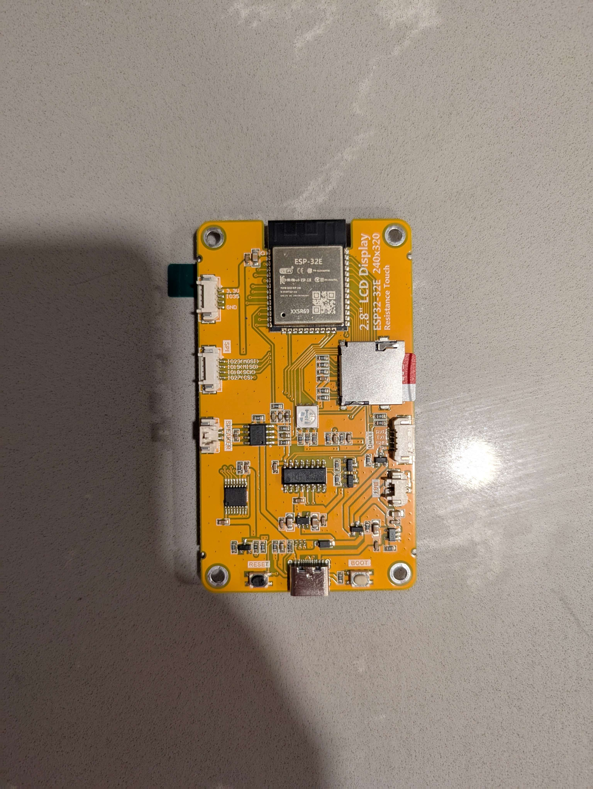
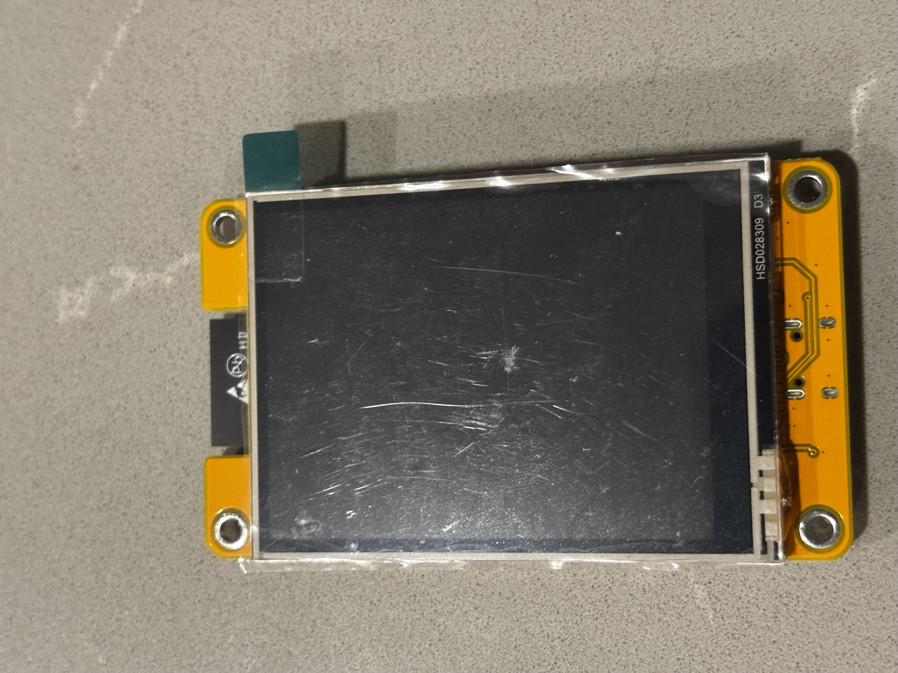
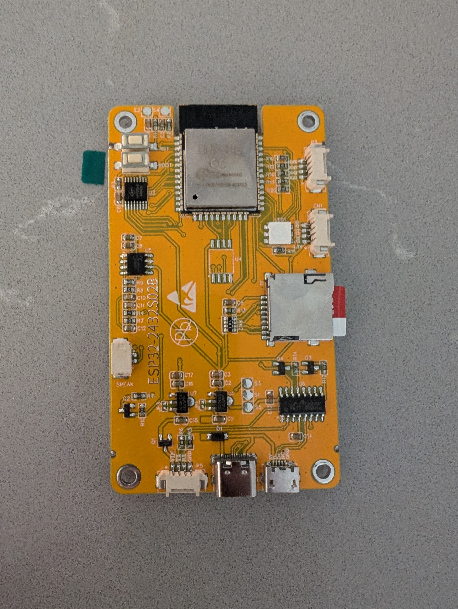
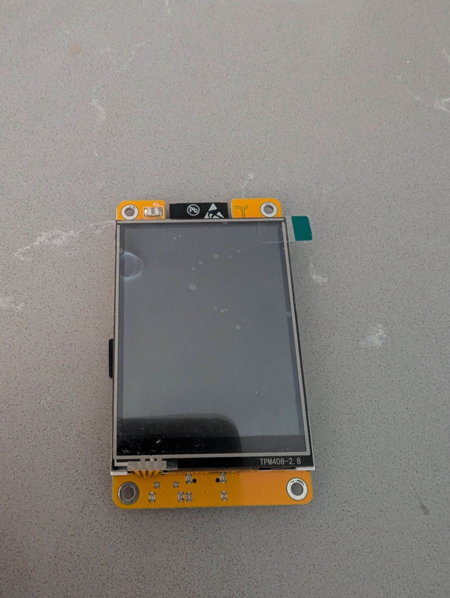

# CYD Identification guide

Here you will find a list of CYD boards with images to assist in identification. If your board is not listed here please join the discord community or open an PR and we'd be happy to include it

---

## Fake CYD ESP32-2432S024R

Compatible firmware package: `CYDDualUSB.zip`

Identifying features:

- Single type C port
- centered RGB LED
- boot/reset buttons next to usb port

---

## AITRIP CYD ESP32-2432S028

Compatible firmware package: `CYDAITIP.zip`

Identifying features:

- Dual USB ports
  - One type-c port
  - One Micro Usb port
- Boot and reset buttons on the top left
- Off center RGB LED

---

## Other CYD Variants

### CYD2USB
- Single USB-C port
- Compatible with standard CYD firmware

### CYDMicroUSB  
- Single Micro USB port
- Compatible with standard CYD firmware

### CYDDualUSB
- Both USB-C and Micro USB ports
- Compatible with standard CYD firmware

---

## Important Notes

- **ESP32-2432S028 (2.8 inch)**: Fully supported with all features
- **ESP32-2432S024 (2.4 inch)**: Not compatible - avoid these boards
- All CYD boards support SD card functionality
- RGB LED control is available on all variants
